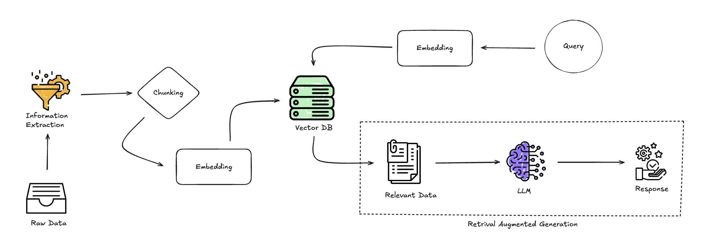

# Capstone Weekly Report

### Date: Sep 03, 2024
- **Topics of Discussion:**
    - **RAG (Retrieval-Augmented Generation):** Understanding the framework and its applications.
    - **LangChain:** Introduction to the library and its role in RAG systems.
    - **Multi-Agent System:** Exploration of how multiple agents can be used to enhance the performance of language models.

- **Action Items:**
    * [ ] Deep dive into RAG architecture.
    * [ ] Explore practical use cases for LangChain in RAG.
    * [ ] Research potential benefits of multi-agent systems in language models.

---

### Date: Sep 10, 2024
- **Topics of Discussion:**
    - **Project Workflow:** Created a general diagram to outline the workflow and architecture.
    - **Dataset Identification:** Found a suitable dataset for the project.
    - **RAG Pipeline:** Built a simple RAG pipeline using basic components.
    - **Model Experimentation:** Tested different models for embeddings and evaluated their effectiveness.
    - **LLM Integration:** Integrated an initial version of a Language Model (LLM) into the pipeline.

- **Action Items:**
    * [ ] Refine the project workflow diagram.
    * [ ] Conduct more experiments with different datasets.
    * [ ] Optimize the RAG pipeline with advanced components.
    * [ ] Continue model experimentation for improved embeddings.
    * [ ] Enhance LLM integration based on feedback.

---

### Date: Sep 17, 2024
- **Topics of Discussion:**
    - **Literature Review:** Plan to review relevant research related to RAG and multi-agent systems.
    - **Modular Code Structure:** Need to develop a code structure that supports scalability and testing.
    - **Testing Scripts:** Write and run test scripts to validate code functionality.
    - **Data Acquisition:** Start the process of data collection and cleaning.
    - **Data Exploration:** Continue testing data from various sources for suitability.

- **Action Items:**
    * [ ] Conduct a thorough literature review on RAG and multi-agent systems.
    * [ ] Design and implement a modular code structure.
    * [ ] Develop and run test scripts for the codebase.
    * [ ] Initiate data acquisition and cleaning process.
    * [ ] Evaluate and test data from different sources for the project.

---

### Date: Sep 24, 2024
- **Topics of Discussion:**
    - **Test Folder Structure and Script Actions:** Refining the test folder structure and defining actions for testing vector store and embedding model.
    - **Main Folder Setup:** Creating a main folder to organize the main functions and core components of the project.
    - **PDF Parser Integration:** Integrating a PDF parser into the system to handle document processing.
    - **PDF Download Function:** Developing a Python function to download PDF documents from links mentioned in the data source of BioASQ - Task B.

- **Action Items:**
    * [ ] Refine the folder structure for test scripts, specifically for vector store and embedding model.
    * [ ] Define specific actions and test cases for validating vector store and embedding model functionalities.
    * [ ] Create a main folder for organizing core functions and essential project components.
    * [ ] Integrate a PDF parser into the system for handling document processing.
    * [ ] Develop a Python function to download PDF documents from links mentioned in BioASQ - Task B data source.
    * [ ] Test the PDF download function with a sample link and validate the parser's integration.

---

